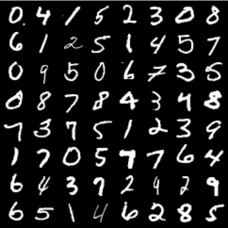
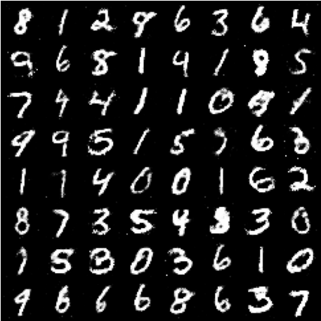
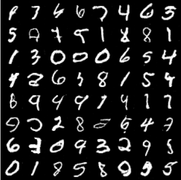
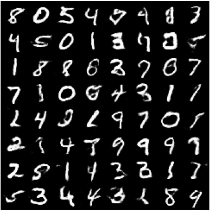
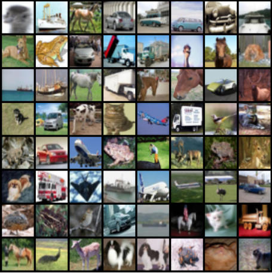

[\[📖中文 ReadMe\]](./README_zh.md)

## Introduction

In this project, I implemented three well-known Generative Adversarial Networks (GANs): GAN, DCGAN, and WGAN-GP. I trained and tested these models on the MNIST and CIFAR10 datasets. The results are displayed below.

<div align="center">
  <h3>Results on MNIST Dataset</h3>
  <table>
    <tr>
      <td>
        
        <p align="center">Real Images</p>
      </td>
      <td>
        
        <p align="center">GAN</p>
      </td>
    </tr>
    <tr>
      <td>
        
        <p align="center">DCGAN</p>
      </td>
      <td>
        
        <p align="center">WGAN-GP</p>
      </td>
    </tr>
  </table>
</div>

<div align="center">
  <h3>Results on CIFAR10 Dataset</h3>
  <table>
    <tr>
      <td>
        
        <p align="center">Real Images</p>
      </td>
      <td>
        
        <p align="center">GAN</p>
      </td>
    </tr>
    <tr>
      <td>
        
        <p align="center">DCGAN</p>
      </td>
      <td>
        
        <p align="center">WGAN-GP</p>
      </td>
    </tr>
  </table>
</div>

## Implementation Details

### [GAN](./modules/gan.py)

Generative Adversarial Networks consist of two networks: a generator and a discriminator. They are trained through an adversarial process, each with opposite optimization goals.

Specifically, the generator's goal is to maximize the discriminator's error rate on generated samples, i.e., the probability that generated samples are classified as real.

$$\min_{\mathrm{G}}\mathbb{E}_{\mathrm{z\sim p_z}}\left[\log(1-\mathrm{D}(\mathrm{G}(\mathrm{z})))\right]$$

where $G$ is the generator, $D$ is the discriminator, $x$ is a real sample, and $z$ is random noise.

The discriminator's goal is to maximize the correct classification rate of real and generated samples.

$$\max_{\mathrm{D}}\mathbb{E}_{\mathrm{x}\sim\mathrm{p}_{\mathrm{data}}}\left[\log\mathrm{D}(\mathrm{x})\right]+\mathbb{E}_{\mathrm{z}\sim\mathrm{p}_{\mathrm{z}}}\left[\log(1-\mathrm{D}(\mathrm{G}(\mathrm{z})))\right]$$

#### Generator Structure

The vanilla GAN generator consists of fully connected layers with `ReLU` activation, and a `tanh` activation at the last layer. The following pseudo-code shows a generator for the MNIST dataset, where the input is a noise vector $z$ sampled from a standard normal distribution with dimension `z_dim`.

```python
(0): linear(in_features=100, out_features=128)
(1): batch_norm(128)
(2): relu()
(3): linear(in_features=128, out_features=256)
(4): batch_norm(256)
(5): relu()
(6): linear(in_features=256, out_features=512)
(7): batch_norm(512)
(8): relu()
(9): linear(in_features=512, out_features=1024)
(10): tanh()
```

It should be noted that batch normalization was not used in the original GAN because it was introduced a year after GANs were proposed. Adding batch normalization to the network is one of the suggestions from DCGAN.

#### Discriminator Structure

The discriminator also consists of fully connected layers with `LeakyReLU` activation. Since it needs to classify the images as real or fake, the last layer uses `Sigmoid` activation. The following pseudo-code shows a discriminator for the MNIST dataset, where the input is an image with shape `1x28x28` and the output is the probability that the image is real.

```python
(0): linear(in_features=784, out_features=512)
(1): leaky_relu()
(2): linear(in_features=512, out_features=256)
(3): leaky_relu()
(4): linear(in_features=256, out_features=128)
(5): leaky_relu()
(6): linear(in_features=128, out_features=1)
(7): sigmoid()
```

Similarly, in the original paper, the activation function used for the discriminator was `maxout`. The use of `LeakyReLU` is a suggestion from DCGAN.

#### Training Strategy

During training, for each batch of training images, the discriminator is trained first, followed by the generator.

```python
# Train Discriminator
d_loss_real = binary_entropy(D(real_images), real_labels)
d_loss_fake = binary_entropy(D(G(z)), fake_labels)
d_loss = d_loss_real + d_loss_fake
update_discriminator(d_loss)

# Train Generator
g_loss = binary_entropy(D(G(z)), real_labels)
update_generator(g_loss)
```

Training GANs can be unstable and sometimes fails to converge. If the discriminator becomes too strong, resulting in the loss dropping to zero, the generator will struggle to learn. Alternatively, the generator might abandon diversity to create realistic images, leading to mode collapse.

### [DCGAN](./modules/dcgan.py)

DCGAN follows the same training mode as GAN but introduces several architectural suggestions:

1. Replace all pooling layers with strided convolutions (discriminator) and fractional-strided convolutions (generator).
2. Use batch normalization in both the generator and the discriminator.
3. Remove fully connected hidden layers for deeper architectures.
4. Use `ReLU` activation in the generator for all layers except the output, which uses `tanh`.
5. Use `LeakyReLU` activation in all layers of the discriminator.

Additionally, there are some training details, such as setting the $\beta_1$ parameter of `Adam` optimizer to $0.5$ instead of the default $0.9$ to avoid training oscillations and instability; adjusting the learning rate to `0.0002` instead of `0.001`; and initializing all network weights from a normal distribution $N(0, 0.02^2)$.

#### Generator Structure

The following pseudo-code shows a generator for the MNIST dataset. The input is a noise vector with shape `z_dim x 1 x 1`, which is progressively upsampled through multiple transposed convolutional layers to output an image with shape `1x28x28`.

```python
(0): conv_transpose(in_channel=100, out_channel=512, kernel_size=(4, 4), stride=(1, 1))
(1): batch_norm(512)
(2): relu()
(3): conv_transpose(in_channel=512, out_channel=256, kernel_size=(3, 3), stride=(2, 2), padding=(1, 1))
(4): batch_norm(256)
(5): relu()
(6): conv_transpose(in_channel=256, out_channel=128, kernel_size=(4, 4), stride=(2, 2), padding=(1, 1))
(7): batch_norm(128)
(8): relu()
(9): conv_transpose(in_channel=128, out_channel=1, kernel_size=(4, 4), stride=(2, 2), padding=(1, 1))
(10): tanh()
```

Each layer's `kernel_size`, `stride`, and `padding` need to be carefully designed to ensure the final output image size is as required. Specifically, the output image size can be calculated using the formula (assuming equal height and width, i.e., $H=W$):

$$
H_\text{out} = (H_\text{in}-1)\times \text{stride} + \text{kernel\_size}-2\times\text{padding}
$$

For example, after the first layer `(0)`, the intermediate feature map shape changes from `[z_dim, 1, 1]` to `[512, 4, 4]`.

#### Discriminator Structure

The discriminator mirrors the generator's convolutional layers. For simple datasets like MNIST, the network should not be too deep to avoid overfitting or making the discriminator too strong.

### [WGAN-GP](./modules/wgan.py)

In the precursor paper to WGAN, [Towards Principled Methods for Training Generative Adversarial Networks](https://arxiv.org/pdf/1701.048

62), it was discussed that as the discriminator in GAN becomes stronger, the generator's gradient diminishes. In an (approximately) optimal discriminator, minimizing the generator's loss is equivalent to minimizing the JS divergence between the real distribution $P_r$ and the generated distribution $P_g$. However, since $P_r$ and $P_g$ almost never overlap significantly, the JS divergence is constant at $\log2$, resulting in a near-zero gradient for the generator, causing gradient vanishing.

Moreover, the distance metrics optimized in Vanilla GAN (KL divergence, JS divergence) are not reasonable and lack a measure to track training progress. To address these issues, WGAN proposes minimizing the Wasserstein Distance as the training objective.

$$W(P_r,P_g)=\inf_{\gamma\in\Pi(P_r,P_g)}\mathbb{E}_{(x,y)\sim\gamma}[\|x-y\|]$$

where $\Pi(P_r, P_g)$ is the set of all joint distributions whose marginals are $P_r$ and $P_g$. The Wasserstein distance measures the minimum cost to transport mass in transforming one distribution into another.

To calculate this, the authors reformulate it as:

$$W(P_r,P_g)=\frac{1}{K}\sup_{\|f\|_L\leq K}\mathbb{E}_{x\sim P_r}\left[f(x)\right]-\mathbb{E}_{x\sim P_g}\left[f(x)\right]$$

where $f(x)$ is the 1-Lipschitz function parameterized by $w$ that we aim to fit with the discriminator. $K$ is the Lipschitz constant.

Using parameters $w$ to approximate all $f_w(x)$, solving the above equation is approximated by:

$$K\cdot W(P_r,P_g)\approx\max_{w:|f_w|_L\leq K}\mathbb{E}_{x\sim P_r}[f_w(x)]-\mathbb{E}_{x\sim P_g}[f_w(x)]$$

Using the discriminator to fit $f_w(x)$, the training objective for the discriminator is:

$$
\max_D\mathbb{E}_{x \sim P_r} [D(x)] - \mathbb{E}_{x \sim P_g} [D(x)]
$$

The generator's objective is the opposite of the discriminator's, i.e., minimizing the second term:

$$
\min_G -\mathbb{E}_{x \sim P_g} [D(x)]
$$

This briefly explains the optimization objective of WGAN. However, since $f_w(x)$ must satisfy the 1-Lipschitz condition, WGAN directly uses weight clipping to restrict the discriminator's weights within a range. This brute force approach limits the model's expressiveness, leading to WGAN-GP, which uses gradient penalty to constrain the weights. This is achieved by adding a term to the WGAN loss function:

$$
\mathcal{L} = \mathbb{E}_{\tilde{x} \sim P_g} \left[D(G(z))\right] - \mathbb{E}_{x \sim P_r} \left[D(x)\right] + \lambda \mathbb{E}_{\hat{x} \sim P_{\hat{x}}} \left[\left(\|\nabla_{\hat{x}} D(\hat{x})\|_2 - 1\right)^2\right]
$$

where $\hat{x}$ is a linear interpolation between real and generated samples, $\hat{x} = \alpha x + (1 - \alpha) G(z)$.

#### Generator Structure

Identical to DCGAN.

#### Discriminator Structure

Because the gradient penalty is applied independently to each input rather than the entire batch, all batch normalization layers are removed. Layer normalization can be used but has shown less effective results. The final `Sigmoid` activation is also removed, as the discriminator's objective is to fit the function $f_w(x)$ rather than the previous binary classification task.

#### Training Strategy
Compared with the original GAN ​​training process, there are several major changes:
1. WGAN uses optimizers such as `RMSProp` and `SGD`, while WGAN-GP recommends using the `Adam` optimizer and setting $\beta=(0, 0.9)$.
2. If you want to use layer norm in the discriminator, setting the weight decay of `1e-3` for the optimizer will have some improvement.
3. Train the generator once every five times the discriminator is trained.