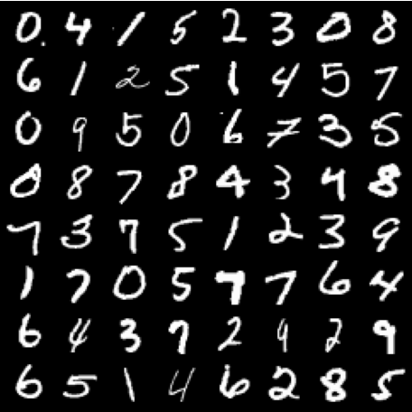
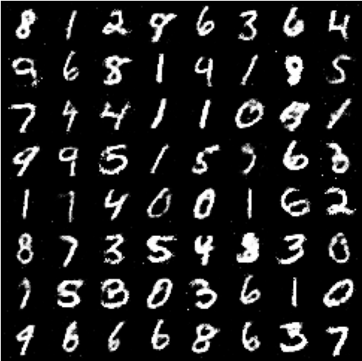
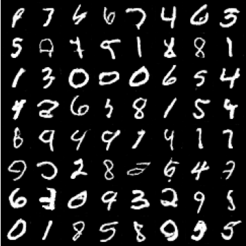
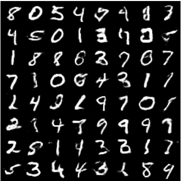
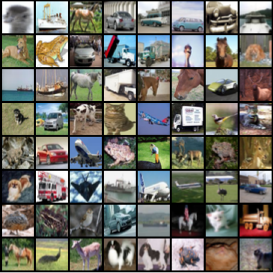
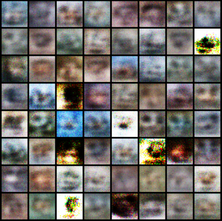
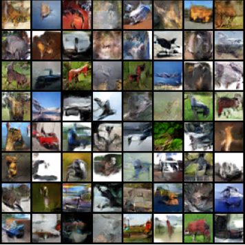
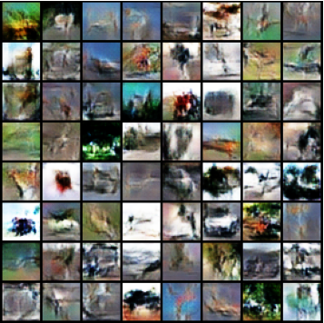

[📖English ReadMe](./README.md)

## 介绍

在这个项目中，我实现了三种著名的生成式对抗网络（GAN）：GAN、DCGAN 和 WGAN-GP。我在 MNIST 和 CIFAR10 数据集上分别训练并测试了这些模型。以下是结果展示。

<div align="center">
  <h3>在 MNIST 数据集上训练并生成的结果</h3>
  <table>
    <tr>
      <td>
        
        <p align="center">真实图像</p>
      </td>
      <td>
        
        <p align="center">GAN</p>
      </td>
    </tr>
    <tr>
      <td>
        
        <p align="center">DCGAN</p>
      </td>
      <td>
        
        <p align="center">WGAN-GP</p>
      </td>
    </tr>
  </table>
</div>

<div align="center">
  <h3>在 CIFAR10 数据集上训练并生成的结果</h3>
  <table>
    <tr>
      <td>
        
        <p align="center">真实图像</p>
      </td>
      <td>
        
        <p align="center">GAN</p>
      </td>
    </tr>
    <tr>
      <td>
        
        <p align="center">DCGAN</p>
      </td>
      <td>
        
        <p align="center">WGAN-GP</p>
      </td>
    </tr>
  </table>
</div>

## 实现细节

### [GAN](./modules/gan.py)

生成式对抗网络实际上是两个网络：生成器和判别器，它们通过博弈的方式训练，彼此有着相反的优化目标。

具体来说，生成器的目标是最大化判别器对生成样本的错误判定概率，即生成样本被判定为真实样本的概率。
  
```math
\min_{\mathrm{G}}\mathbb{E}_{\mathrm{z\sim p_z}}\left[\log(1-\mathrm{D}(\mathrm{G}(\mathrm{z})))\right]
```

其中， $G$ 是生成器， $D$ 是判别器， $x$ 是真实样本， $z$ 是随机噪声。

判别器的目标是最大化对真实样本和生成样本的正确判定概率。
  
```math
\max_{\mathrm{D}}\mathbb{E}_{\mathrm{x}\sim\mathrm{p}_{\mathrm{data}}}\left[\log\mathrm{D}(\mathrm{x})\right]+\mathbb{E}_{\mathrm{z}\sim\mathrm{p}_{\mathrm{z}}}\left[\log(1-\mathrm{D}(\mathrm{G}(\mathrm{z})))\right]
```

#### 生成器结构

Vanilla GAN 的生成器仅由一些全连接层组成，并以 `ReLU` 激活，最后一层使用 `tanh`。下面的伪代码展示了一个用于 MNIST 数据集的生成器，输入是一个从标准正态分布中采样得到的维度为 `z_dim` 的噪声向量 $z$。

```python
(0): linear(in_features=100, out_features=128)
(1): batch_norm(128)
(2): relu()
(3): linear(in_features=128, out_features=256)
(4): batch_norm(256)
(5): relu()
(6): linear(in_features=256, out_features=512)
(7): batch_norm(512)
(8): relu()
(9): linear(in_features=512, out_features=1024)
(10): tanh()
```

需要注意的是，在原版的 GAN 中并没有使用 batch norm，这是因为 batch norm 在 GAN 发表一年之后才被提出。而向网络加入 batch norm 正是 DCGAN 的建议之一。

#### 判别器结构

判别器同样由一些全连接层组成，并以 `LeakyReLU` 激活。由于它需要完成对图片的真伪二分类任务，因此最后一层以 `Sigmoid` 结尾。下面的伪代码展示了一个用于 MNIST 数据集的判别器，输入是一个 shape 为 `1x28x28` 的图像，输出是认为这张图像是真实图像的概率。

```python
(0): linear(in_features=784, out_features=512)
(1): leaky_relu()
(2): linear(in_features=512, out_features=256)
(3): leaky_relu()
(4): linear(in_features=256, out_features=128)
(5): leaky_relu()
(6): linear(in_features=128, out_features=1)
(7): sigmoid()
```

同样，在原始论文中，判别器的激活函数实际上是 `maxout`，使用 `LeakyReLU` 是来自于 DCGAN 的建议。

#### 训练策略

训练时，对于每一批次训练图片，先训练判别器，再训练生成器。

```python
# Train Discriminator
d_loss_real = binary_entropy(D(real_images), real_labels)
d_loss_fake = binary_entropy(D(G(z)), fake_labels)
d_loss = d_loss_real + d_loss_fake
update_discriminator(d_loss)

# Train Generator
g_loss = binary_entropy(D(G(z)), real_labels)
update_generator(g_loss)
```

GAN 的训练是不稳定的，有时甚至无法收敛。如果判别器太强以至于 loss 降低为 0，那么生成器将无法继续学习，或者为了尽可能生成逼真图片而完全放弃多样性，造成模式崩溃。

### [DCGAN](./modules/dcgan.py)

DCGAN 在训练模式上与 GAN 完全相同，但是在结构设计上提出了一些建议：

1. 用 stride 卷积（判别器）和 fractional stride 卷积（生成器）替换所有池化层。
2. 在生成器和判别器中都使用 batch norm。
3. 从更深的网络中移除全连接隐层。
4. 在生成器中，除了输出层使用 `tanh` 激活之外，其他层都使用 `ReLU`。
5. 在判别器中，所有层均使用 `LeakyReLU`。

此外，还有一些训练的细节，例如将 `Adam` 的 $\beta_1$ 设置为 $0.5$ 而不是默认的 $0.9$ 以避免训练时的震荡和不稳定；学习率应当调整为 `0.0002` 而不是 `0.001`；网络的所有权重从 $N(0, 0.02^2)$ 初始化。

#### 生成器结构

下面的伪代码展示了一个用于 MNIST 数据集的生成器。其输入为一个 shape 为 `z_dim x 1 x 1` 的噪声向量，经过多层转置卷积逐步扩大特征图，最终输出为 `1x28x28` 的图像。

```python
(0): conv_transpose(in_channel=100, out_channel=512, kernel_size=(4, 4), stride=(1, 1))
(1): batch_norm(512)
(2): relu()
(3): conv_transpose(in_channel=512, out_channel=256, kernel_size=(3, 3), stride=(2, 2), padding=(1, 1))
(4): batch_norm(256)
(5): relu()
(6): conv_transpose(in_channel=256, out_channel=128, kernel_size=(4, 4), stride=(2, 2), padding=(1, 1))
(7): batch_norm(128)
(8): relu()
(9): conv_transpose(in_channel=128, out_channel=1, kernel_size=(4, 4), stride=(2, 2), padding=(1, 1))
(10): tanh()
```

这里每一层的 `kernel_size`、`stride` 和 `padding` 都需要精心设计，使得最终输出的图像大小满足要求。具体来说，可以按以下公式计算输出图像的大小（假设均在长宽相等的图上操作，即 $H=W$）：

```math
H_\text{out} = (H_\text{in}-1)\times \text{stride} + \text{kernel-size}-2\times\text{padding}
```

例如经过第 `(0)` 层后，中间特征图形状的变化为 `[z_dim, 1, 1]`$\rightarrow$`[512, 4, 4]`。

#### 判别器结构

判别器在卷积层参数上与生成器保持对称。注意，对于 MNIST 这样的简单数据集不应使用太深的网络，以避免判别器过强或过拟合数据集。

### [WGAN-GP](./modules/wgan.py)

在 WGAN 的前身论文 [Towards Principled Methods for Training Generative Adversarial Networks](https://arxiv.org/pdf/1701.04862) 中讨论了当 GAN 的判别器越强时，生成器梯度消失越严重的原因：在（近似）最优判别器下，最小化生成器的 loss 等价于最小化真实分布 $P_r$ 和生成分布 $P_g$ 之间的 JS 散度，而由于 $P_r$ 和 $P_g$ 几乎不可能有不可忽略的重叠，所以无论它们相距多远 JS 散度都是常数 $\log2$，最终导致生成器的梯度（近似）为 0，梯度消失。

此外，Vanilla GAN 等价优化的距离衡量（KL 散度、JS 散度）不合理，而且缺少一个指标来衡量训练进程。基于上述考量，WGAN 提出使用最小化 Wasserstein Distance 来作为训练的目标

```math
W(P_r,P_g)=\inf_{\gamma\in\Pi(P_r,P_g)}\mathbb{E}_{(x,y)\sim\gamma}[\|x-y\|]
```

其中， $\Pi(P_r, P_g)$ 是所有边际分布为 $P_r$ 和 $P_g$ 的联合分布的集合。Wasserstein 距离度量了将一个分布转换为另一个分布所需的最小工作量。

为了计算这个式子，作者将其转换为

```math
W(P_r,P_g)=\frac{1}{K}\sup_{\|f\|_L\leq K}\mathbb{E}_{x\sim P_r}\left[f(x)\right]-\mathbb{E}_{x\sim P_g}\left[f(x)\right]
```

其中， $f(x)$ 是我们将要用判别器去拟合的 1-Lipschitz 函数，用于衡量样本 $x$ 的真实性；$K$ 是 1-Lipschitz 常数。

进一步地，我们使用参数 $w$ 来参数化所有的 $f_w(x)$，此时求解上式近似于求解

```math
K\cdot W(P_r,P_g)\approx\max_{w:|f_w|_L\leq K}\mathbb{E}_{x\sim P_r}[f_w(x)]-\mathbb{E}_{x\sim P_g}[f_w(x)]
```

我们使用判别器去拟合 $f_w(x)$，那么判别器的训练目标为

```math
\max_D\mathbb{E}_{x \sim P_r} [D(x)] - \mathbb{E}_{x \sim P_g} [D(x)]
```

生成器的目标与判别器相反，即最小化上式的后一项：

```math
\min_G -\mathbb{E}_{x \sim P_g} [D(x)]
```

至此，我们已经简要说明了 WGAN 的优化目标。但是由于 $f_w(x)$ 必须满足 1-Lipschitz 条件，WGAN 直接使用了权重裁剪，将判别器的权重限制到一个范围内。然而这样暴力的做法直接限制了模型的表达能力，因此 WGAN-GP 提出使用梯度惩罚来限制权重。只需要在 WGAN 损失函数加上一项即可

```math
\mathcal{L} = \mathbb{E}_{\tilde{x} \sim P_g} \left[D(G(z))\right] - \mathbb{E}_{x \sim P_r} \left[D(x)\right] + \lambda \mathbb{E}_{\hat{x} \sim P_{\hat{x}}} \left[\left(\|\nabla_{\hat{x}} D(\hat{x})\|_2 - 1\right)^2\right]
```

其中， $\hat{x}$ 是生成数据和真实数据之间的线性插值样本，即 $\hat{x} = \alpha x + (1 - \alpha) G(z)$。

#### 生成器结构

与 DCGAN 完全相同。

#### 判别器结构

由于对每个输入独立地惩罚判别器梯度的范数，而不是整个批次，因此去掉了所有的 batch norm。事实上也可以使用 layer norm，但经测试效果不佳。还要把最后的 `Sigmoid` 激活函数去掉，因为现在判别器的训练目标是拟合函数 $f_w(x)$ 而不是之前的二分类任务。

#### 训练策略
相比原始GAN的训练流程，主要有以下几点改变：
1. WGAN使用的是`RMSProp`、`SGD`这样的优化器，而WGAN-GP建议使用`Adam`优化器并设 $\beta=(0, 0.9)$。
2. 如果要在判别器中使用layer norm，给优化器设置`1e-3`的权重衰减会有一些提升。
3. 每训练五次判别器再训练一次生成器。

