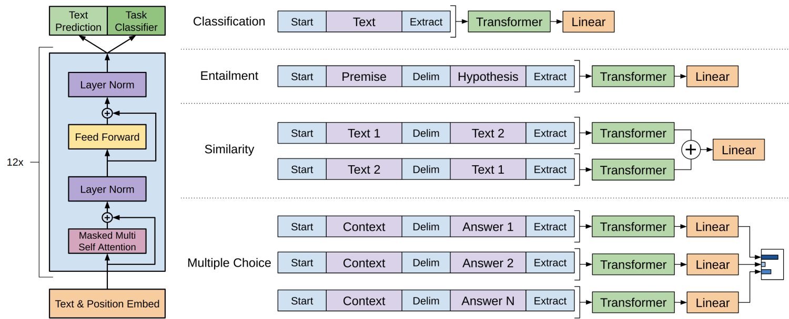

[$$ 📖 English ReadMe]](./README.md)  
## Introduction  
在这个 GPT 的实现中，我将展示如何在 [BookCorpus](https://huggingface.co/datasets/bookcorpus/bookcorpus) 数据集上进行预训练，然后从 [huggingface](https://huggingface.co/openai-community/openai-gpt) 上加载官方的预训练权重到我们的模型中，在 [Stanford Sentiment Treebank (SST-2)](https://nlp.stanford.edu/~socherr/EMNLP2013_RNTN.pdf) 数据集上进行微调，并复现论文中提到的效果。

## Model details  
### Key differences with vanilla transformer  
1. GPT 只使用了原始 transformer 的 Decoder。由于不再需要 Encoder，因此删去了与 Encoder 交互的交叉自注意力，只使用因果自注意力层。  
2. GPT 的 Decoder 层中的前馈神经网络层去掉了一次 dropout。此外，还将激活函数从 ReLU 替换为了 GeLU。  
3. GPT 的模型规模略微扩大了一些，还固定了词表的大小（因为 GPT 是预训练模型）。  
4. GPT 使用了 [Weight Tying](https://arxiv.org/abs/1608.05859)，令 language modelling head 与 token embedding 层共享权重。  
5. GPT 使用 learnable positional embedding 而不是正余弦位置编码。

汇总如下表所示：  
<table>  
  <thead>  
    <tr style="font-weight: bold; border-bottom: 2px solid">  
      <th></th>  
      <th style="text-align: center">GPT</th>  
      <th style="text-align: center">Transformer</th>  
    </tr>  
  </thead>  
  <tbody style="text-align:center">  
    <tr>  
      <td>Positonal encoding</td>  
      <td> learnable </td>  
      <td> sinusoidal(mainstream) </td>  
    </tr>  
    <tr>  
      <td>n_head</td>  
      <td>12</td>  
      <td>8</td>  
    </tr>  
    <tr>  
      <td>n_layer</td>  
      <td>12</td>  
      <td>6 encoder layers, 6 decoder layers</td>  
    </tr>  
    <tr>  
      <td>d_model</td>  
      <td>768</td>  
      <td>512</td>  
    </tr>  
    <tr>  
      <td>vocab_size</td>  
      <td>40478</td>  
      <td>depends on dataset</td>  
    </tr>  
    <tr>  
      <td>FFN path</td>  
      <td style="text-align:left">  
      <pre>  
      <code>  
      mlpf = lambda x: dropout(fc2(gelu(fc1(x))))  
      x = x + layer_norm(mlpf(x))  
      </code>  
      </pre>  
      </td>  
      <td style="text-align:left">  
      <pre>  
      <code>  
      mlpf = lambda x: dropout(fc2(dropout(relu(fc1(x)))))  
      x = x + layer_norm(mlpf(x))  
      </code>  
      </pre>  
      </td>  
    </tr>  
  </tbody>  
</table>

### [Byte-pair encoding (BPE)](./modules/bpe.py)  
BPE 是一种 tokenize 的方法，其核心思想是通过合并最频繁出现的字符对来构建更大的子词单元，从而减少词汇表的大小，处理稀有词问题。它需要先在一个语料库上进行训练，得到词表后才能进行编码和解码。

由于 Huggingface 提供的 [BookCorpus](https://huggingface.co/datasets/bookcorpus/bookcorpus) 数据集已经经过了细致的后处理，因此我们无法完全复现出 [原始 GPT 代码](https://github.com/openai/finetune-transformer-lm) 的结果。我仅基于原始实现 [text_utils.py](https://github.com/openai/finetune-transformer-lm/blob/master/text_utils.py) 完成了编码和解码部分的工作。如果你对 BPE 的训练流程感兴趣，可以参考 Karpathy 的 [minbpe](https://github.com/karpathy/minbpe)。

#### Training  
1. 预分词：用 [`ftfy`](https://github.com/rspeer/python-ftfy) 规范化 Unicode 字符，把非标准标点统一，并替换所有的空白字符为 `\n`，然后使用 spacy 的 [en_core_web_sm](https://spacy.io/models/en#en_core_web_sm) 模型进行分词（见 [bpe.py](./modules/bpe.py)）。  
2. 初始化词汇表：将整个文本语料库拆分成单字符的子词单元，最后一个字符添加 `</w>`。在训练后的词表 [encoder_bpe_40000.json](./datasets/bookcorpus/encoder_bpe_40000.json) 中可以看出，id 从 1~238 都为单个字符，239~476 为单个字符 + `</w>` 的形式。这里的 `</w>` 代表一个 token 的结尾。例如在单词 `bamboo` 中，最后一个 `o` 会被视作 `o</w>` 以与倒数第二个 `o` 区分。  
3. 统计 bi-gram 字符对的频率。  
4. 合并最频繁出现的字符对，并形成一个新的子词单元。更新语料库中的词汇表，并记录该合并操作。  
5. 重复步骤 3-4 40000 次，于是在 476 个单个词元的基础上获得了 40000 个新的子词单元。再加上 `<unk>` 和 `\n</w>` 共计 40478 个词元。

#### Encoding  
0. 加载训练好的词表。  
1. 预分词：对输入的文本进行预分词，同训练阶段。  
2. 将每个子词拆分成单字符的子词单元，最后一个字符添加 `</w>`。  
3. 统计 bi-gram 字符对的频率。  
4. 选择在词表中最早被合并的字符对，并形成一个新的子词单元。将目前文本中出现的字符对以新子词单元进行替换。  
5. 重复步骤 3-4 直到没有更多的有效 bigram 或者只剩一个字符单元。  
6. 缓存结果，将子词单元映射到词表中对应 token 的 id。

#### Decoding  
0. 加载训练好的词表。  
1. 根据词表建立反向映射，将给定 token id 映射回原子词即可。
  
## [Pre-training](./pretrain.ipynb)  
根据 [Improving Language Understanding by Generative Pre-Training](https://cdn.openai.com/research-covers/language-unsupervised/language_understanding_paper.pdf) Sec. 4.1 的设置，在 BooksCorpus 数据集上，使用 AdamW ($w = 0.01, \text{max\_lr} = 2.4\times 10^{-4}$) 作为优化器，注意：所有 **偏置和缩放层（`LayerNorm`）的参数权重不会应用权重衰减**。使用先使学习率从 0 分 2000 步线性增加到 $\text{max\_lr}$，而后余弦退火的学习率调整策略，对随机采样的 64 个连续 512 个 token sequences 的 minibatch 进行 100 个 epoch 的训练。

为了采样连续指定数量的 token sequence，我们需要先用 bpe 把原数据集的文本转换为 token id。而我们自己实现的 tokenize 速度非常慢，因此只能在小部分数据集上进行实验。如果你想要尝试更多的数据，可以修改 [pretrain.ipynb](./pretrain.ipynb) 中 `load_data` 的 `loading_ratio` 参数。

## [Fine-tuning](./train.ipynb)  
在 BookCorpus 数据集上与训练后，GPT 已经获得了一定的语言能力，要将其运用到新的数据集上，只需要略微调整一下模型结构和输入即可。

<div>  
    
</div>

原论文中 Sec. 3.2 提到，添加 language modelling loss 作为微调的辅助目标有助于学习，因为 (a) 可以提高监督模型的泛化能力，(b) 可以加速收敛。因此除了要向词表中添加一些新的 tokens（`<pad>`、`<start>` 和 `<extract>`）之外，还需把 decoder 骨干的输出输入到一个新增的分类头中。

微调基本重用预训练中的超参数设置。分类器之前添加 dropout 层（$p =

 0.1$）。学习率用 $6.25e^{-5}$，批大小用 32。在大多数情况下，训练 3 个 epoch 就足够了。此外，还使用带 warmup 的线性学习率衰减策略，预热训练总轮数的 $0.2\%$。分类损失的权重设置为 0.5。

## [Inference](./inference.ipynb)  
在推理阶段，我们将把预训练参数加载到我们的 GPT 上，并与微调过的模型进行比较它们的生成能力。还在 sst2 的测试集上评估微调后模型的性能，得到了 91% 的准确率，这与原论文在

## Appendix  
### How to download pretrained GPT?  
在命令行运行以下指令  
```bash  
pip install -U huggingface-cli  
export HF_ENDPOINT=https://hf-mirror.com  
huggingface-cli download openai-community/openai-gpt --local-dir path/to/pretrained_dir  
```