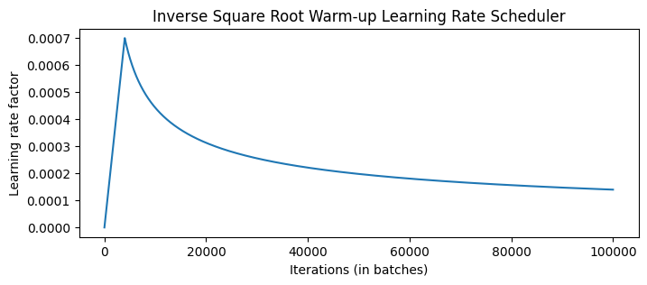

[```📖中文 ReadMe\]](./README_zh.md)
## Introduction
Here, I have implemented a Transformer and used it for an English-to-German translation task on the IWSLT 2017 dataset (see [here](./train.ipynb)). After training the model, you can load the model and perform inference [here](./inference.ipynb).

## Model details
### [Transformer](./modules/transformer.py)
The Transformer was initially proposed for translation tasks. If we aim to translate from Chinese to English, we refer to Chinese as the source language and English as the target language. The structure of the Transformer is shown in the figure below. The embedding of the source text is added to the positional encoding and fed into the Encoder. After passing through N layers of Encoder layers, the output interacts in the cross-attention of the Decoder. Similarly, the embedding of the target text is added to the positional encoding and fed into the Decoder. The output of the Decoder typically passes through a linear layer (depending on the task requirements).
<div style="text-align: center;">
  
</div>

The Encoder and Decoder use two types of masks, `src_mask` and `tgt_mask`. `src_mask` is used to mask all PAD tokens to prevent them from affecting the attention calculation. `tgt_mask` masks all PAD tokens and prevents the model from accessing future words during next word prediction.

### [Positional Encoding](./modules/layers.py)
Since the Transformer lacks the natural sequential characteristics of RNNs and loses order information when computing attention, positional encoding is introduced. In the original paper, the calculation formulas for positional encoding are as follows:

- For even dimensions:
  ```math
   \text{PE}(pos, 2i) = \sin\left(\frac{pos}{10000^{2i/d_{\text{model}}}}\right)
  ```

- For odd dimensions:
  ```math
  \text{PE}(pos, 2i+1) = \cos\left(\frac{pos}{10000^{2i/d_{\text{model}}}}\right) 
  ```

For numerical stability, we take the exponent and logarithm of the div term:
```math
\text{div-term} = 10000^{2i/d_{\text{model}}} = \exp\left(\frac{2i \cdot -\log(10000)}{d_{\text{model}}}\right)
```

Positional encoding is the same for any sequence, so the shape of the positional encoding is `[seq_len, d_model]`. It is added to the input embedding with shape `[batch_size, seq_len, d_model]` through broadcasting to obtain the Encoder's input, denoted as $x_0$.

## [Encoder](./modules/encoder.py)
The Encoder consists of multiple identical layers. The output $x_i$ from the previous layer passes through the layer as follows (omitting dropout):
```python
# attention mechanism
residual = x
x = multihead_attention(q=x, k=x, v=x, mask=src_mask)
x = layer_norm(x + residual)

# position-wise feed forward
residual = x
x = feed_forward(x)
x = layer_norm(x + residual)
```

## [Attention](./modules/layers.py)
The attention calculation process is as follows:
<div style="text-align: center;">
  
</div>
In the Encoder's self-attention, K, Q, and V are obtained from the output of the previous layer through different linear layers. In the Decoder's cross-attention, K and V come from the output of the last layer of the Encoder, while Q is the output of the previous layer of the Decoder.

To make the model focus on different subspace information at different positions, we use multi-head attention. Specifically, K, Q, and V with shape `[batch_size, seq_len, d_model]` are split into `[batch_size, seq_len, n_head, d_key]`, then the dimensions of `seq_len` and `n_head` are swapped for matrix multiplication in the attention mechanism. After calculating the attention, the results are concatenated and mapped to the same dimension as the input through a linear layer. The algorithm flow is as follows:
```python
# projection
K, Q, V = W_k(x), W_q(x), W_v(x)

# split
d_key = d_model // n_head
K, Q, V = (K, Q, V).view(batch_size, seq_len, n_head, d_key).transpose(1, 2)
out = scaled_dot_product_attention(K, Q, V)

#concatenate
out = out.transpose(1, 2).view(batch_size, seq_len, d_model)
out = W_cat(out)
```

Scaled Dot-Product Attention is represented by the formula:
```math
\text{Attention}(Q,K,V) = \text{softmax}\left(\frac{QK^\top}{\sqrt{d_{key}}}\right) \cdot V
```

## [Decoder](./modules/decoder.py)
The Decoder differs from the Encoder by having an additional cross-attention layer and using masked multi-head attention. Since the model cannot access future information here, this attention mechanism is also called causal self-attention.
The Decoder also consists of multiple identical layers. The output `enc` from the last layer of the Encoder and the output `dec` from the previous layer of the Decoder pass through the layer as follows (omitting dropout):
```python
# causal self-attention
residual = dec
x = multihead_attention(q=dec, k=dec, v=dec, mask=src_mask)
x = layer_norm(x + residual)

# cross-attention
x = multihead_attention(q=x, k=enc, v=enc, mask=tgt_mask)
x = layer_norm(x + residual)

# position-wise feed forward
residual = x
x = feed_forward(x)
x = layer_norm(x + residual)
```

## Training Strategy
### Training Data and Batching
[Attention is all you need](https://arxiv.org/pdf/1706.03762) Sec 5.1 mentions that the training set used is WMT 2014, with approximately 25k source tokens and 25k target tokens in each training batch, resulting in 6,230 batches. The average batch size is 724, and the average length is 45 tokens. Considering the GPU memory constraints, gradient accumulation is needed to ensure sufficient tokens in each batch, updating gradients every `update_freq` rounds.

The paper also mentions training the base transformer for 100,000 iterations, which should correspond to 16 epochs under this setting.

### Optimizer
[Attention is all you need](https://arxiv.org/pdf/1706.03762) Sec 5.3 mentions using Adam as the optimizer with parameters $\beta_1 = 0.9, \beta_2 = 0.98, \epsilon = 10^{-9}$. Additionally, the learning rate changes during training according to the following formula:

```math
lrate=d_{\mathrm{model}}^{-0.5}\cdot\min(step\_ num^{-0.5},step\_ num\cdot warmup\_ steps^{-1.5})
```

This means linearly increasing the learning rate in the first $warmup_steps$ training steps, then decreasing it proportionally to the inverse square root of the step number. The base transformer was trained for 100,000 steps, with $warmup\_ steps = 4000$ under this setting. The visualization of learning rate is shown as below
<div style="text-align: center;">
  
</div>


### Label Smoothing
[Attention is all you need](https://arxiv.org/pdf/1706.03762) Sec 5.4 mentions that using label smoothing slightly improves BLEU and accuracy, although it harms perplexity. Label smoothing, proposed in [Rethinking the Inception Architecture for Computer Vision](https://arxiv.org/pdf/1512.00567), is a regularization technique that smooths the target labels when computing the loss, preventing the model from becoming overly confident in predicting single classes. Specifically, it transforms hard labels (one-hot vectors) into soft labels, introducing some uncertainty during training.

For a classification task with $C$ classes, the smoothed target distribution $y_{\text{smooth}}$ for each sample $x$ is defined as:

```math
y_{\text{smooth}} = (1 - \epsilon) \cdot y_{\text{one-hot}} + (1-y_{\text{one-hot}})\cdot \frac{\epsilon}{C-1}
```

where $\epsilon$ is the smoothing parameter, defaulting to 0.1. $y_{\text{one-hot}}$ is the original one-hot label.

You can modify `eps_ls` in [config.py](./config.py) to control the value of $\epsilon$. If $\epsilon=0$, label smoothing is disabled, and cross-entropy is used as the loss function.

## Evaluation
To evaluate the effectiveness of the machine translation, this implementation follows the setup from [Attention is all you need](https://arxiv.org/pdf/1706.03762) and uses the [BLEU](https://aclanthology.org/P02-1040.pdf) score. The specific process involves passing the source and target languages through the forward process of the transformer, then using greedy decode to select the token with the highest probability from the decoder output as the prediction. The BLEU score is then calculated using [sacrebleu](https://github.com/mjpost/sacrebleu).

To further improve the translation quality, beam search can be used as the decode method, and contributions are welcome :) .