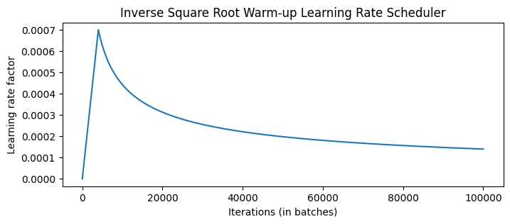

[📖English ReadMe](./README.md)
## Introduction
在这里，我实现了一个 Transformer，并使用其在 IWSLT 2017 数据集上进行了英-德翻译任务（见[此](./train.ipynb)）。在训练模型之后，你可以在[此](./inference.ipynb)加载模型并进行推理。

## Model details
### [Transformer](./modules/transformer.py)
Transformer 最初被提出用于解决翻译任务。如果要实现中文到英文的翻译，那么我们称中文为源语言，英文为目标语言。Transformer 的结构如下图所示，源文本的 embedding 与 positional encoding 相加后输入到 Encoder，经过 N 层 Encoder layer 后，输出在 Decoder 的 cross attention 中进行交互。目标文本的 embedding 同样与 positional encoding 相加后输入到 Decoder，Decoder 的输出通常会再经过一个线性层（具体取决于任务要求）。
<div style="text-align: center;">
  
</div>

Encoder 和 Decoder 分别使用了两种 mask，`src_mask` 和 `tgt_mask`。`src_mask` 用于遮盖所有的 PAD token，避免它们在 attention 计算中产生影响。`tgt_mask` 除了遮盖所有 PAD token，还要防止模型在进行 next word prediction 时访问未来的词。

### [Positional Encoding](./modules/layers.py)
由于 Transformer 不像 RNN 那样具有天然的序列特性，在计算 attention 时会丢失顺序信息，因此需要引入位置编码。在原始论文中，位置编码的计算公式如下：

- 对于偶数维度：
  ```math
   \text{PE}(pos, 2i) = \sin\left(\frac{pos}{10000^{2i/d_{\text{model}}}}\right)
  ```

- 对于奇数维度：
  ```math
  \text{PE}(pos, 2i+1) = \cos\left(\frac{pos}{10000^{2i/d_{\text{model}}}}\right) 
  ```

为了数值稳定性，我们对 div term 取指数和对数，即：
```math
\text{div-term} = 10000^{2i/d_{\text{model}}} = \exp\left(\frac{2i \cdot -\log(10000)}{d_{\text{model}}}\right)
```

位置编码对任何序列都是相同的，因此 positional encoding 的 shape 为 `[seq_len, d_model]`。然后根据广播机制与 shape 为 `[batch_size, seq_len, d_model]` 的 input embedding 相加，得到 Encoder 的输入，记作 $x_0$。

## [Encoder](./modules/encoder.py)
Encoder 包含多个相同的层。上一层的输出 $x_i$ 以如下途径经过该层（省略了 dropout）：
```python
# attention mechanism
residual = x
x = multihead_attention(q=x, k=x, v=x, mask=src_mask)
x = layer_norm(x + residual)

# position-wise feed forward
residual = x
x = feed_forward(x)
x = layer_norm(x + residual)
```

## [Attention](./modules/layers.py)
Attention 的计算流程如下：
<div style="text-align: center;">
  
</div>
在 Encoder 的 self-attention 中，K、Q、V 均为上一层的输出经过不同线性层得到的。在 Decoder 的 cross-attention 中，K 和 V 来自 Encoder 最后一层的输出，而 Q 是 Decoder 上一层的输出。

为了使模型关注不同位置的不同特征子空间信息，我们需要使用多头注意力。具体来说，将 shape 为 `[batch_size, seq_len, d_model]` 的 K、Q、V 分为 `[batch_size, seq_len, n_head, d_key]`，再交换 `seq_len` 和 `n_head` 两个维度，以便进行 attention 机制中的矩阵乘法。计算了 attention 之后再将结果合并，并通过一个线性层映射到与输入相同的维度。算法的流程如下：
```python
# projection
K, Q, V = W_k(x), W_q(x), W_v(x)

# split
d_key = d_model // n_head
K, Q, V = (K, Q, V).view(batch_size, seq_len, n_head, d_key).transpose(1, 2)
out = scaled_dot_product_attention(K, Q, V)

# concatenate
out = out.transpose(1, 2).view(batch_size, seq_len, d_model)
out = W_cat(out)
```

Scaled Dot-Product Attention 用公式表示为：
```math
\text{Attention}(Q,K,V) = \text{softmax}\left(\frac{QK^\top}{\sqrt{d_{key}}}\right) \cdot V
```

## [Decoder](./modules/decoder.py)
Decoder 相较于 Encoder 除了多了一层 cross-attention 之外，还使用了 masked multi-head attention。由于模型在此处不能访问未来信息，因此这种注意力机制也称为 causal self-attention。
Decoder 同样包含多个相同的层，Encoder 最后一层的输出 `enc` 和 Decoder 上一层的输出 `dec` 以如下途径经过该层（省略了 dropout）：
```python
# causal self-attention
residual = dec
x = multihead_attention(q=dec, k=dec, v=dec, mask=tgt_mask)
x = layer_norm(x + residual)

# cross-attention
x = multihead_attention(q=x, k=enc, v=enc, mask=tgt_mask)
x = layer_norm(x + residual)

# position-wise feed forward
residual = x
x = feed_forward(x)
x = layer_norm(x + residual)
```

## Training Strategy
### Training Data and Batching
[Attention is all you need](https://arxiv.org/pdf/1706.03762) Sec 5.1 提到，训练集使用的是 WMT 2014，每一个训练批次有大约 25k source tokens 和 25k target tokens，结果产生了 6,230 个批次。平均批次大小为 724，平均长度为 45 个 tokens。考虑到 GPU 显存不足，为了确保每个批次都有足够的 tokens，因此需要采取梯度累积策略，每 `update_freq` 轮才更新一次梯度。

论文还提到对 base transformer 进行了 100,000 次迭代训练，这应该对应于 16 个 epochs。

### Optimizer
[Attention is all you need](https://arxiv.org/pdf/1706.03762) Sec 5.3 提到，优化器使用的是 Adam，参数依次为 $\beta_1 = 0.9, \beta_2 = 0.98, \epsilon = 10^{-9}$。此外，根据如下公式，在训练过程中改变了学习率：

```lrate = d_{\mathrm{model}}^{-0.5}\cdot\min(step\_ num^{-0.5},step\_ num\cdot warmup\_ steps^{-1.5})```

这相当于在前 $warmup_steps$ 训练步骤中线性增加学习率，然后按步数的平方根倒数比例降低学习率。Transformer base 训练了 100,000 步，在此设置下 $warmup\_ steps = 4000$。学习率的可视化如下所示：
<div style="text-align: center;">
  
</div>

### Label Smoothing
[Attention is all you need](https://arxiv.org/pdf/1706.03762) Sec 5.4 提到使用标签平滑技术虽然会损害模型的困惑度，但可以略微提升 BLEU 和准确率。标签平滑是 [Rethinking the Inception Architecture for Computer Vision](https://arxiv.org/pdf/1512.00567) 中提出的。它是一种正则化技术，通过在计算损失时对目标标签进行平滑处理，从而防止模型过度自信地预测单个类别。具体而言，它将标签从硬标签（one-hot vector）转变为软标签（soft labels），从而在训练过程中引入一些不确定性。

假设有一个类别数为 $C$ 的分类任务，对于每个样本 $x$，标签平滑后的目标分布 $y_{\text{smooth}}$ 定义为：

```math
y_{\text{smooth}} = (1 - \epsilon) \cdot y_{\text{one-hot}} + (1-y_{\text{one-hot}})\cdot \frac{\epsilon}{C-1}
```

其中，$\epsilon$ 是平滑参数，默认为 0.1。$y_{\text{one-hot}}$ 是原始的 one-hot 标签。

你可以在 [config.py](./config.py) 中修改 `eps_ls` 控制 $\epsilon$ 的大小。如果 $\epsilon=0$ 则将

禁用标签平滑，使用交叉熵作为损失函数。

## Evaluation
为了评估机器翻译的效果，本实现遵循了 [Attention is all you need](https://arxiv.org/pdf/1706.03762) 的设置，使用 [BLEU](https://aclanthology.org/P02-1040.pdf) 分数。具体过程是，先使源语言和目标语言经过 transformer 的前向过程，然后使用 greedy decode 的方法从 decoder 输出中选取概率最大的 token 作为预测结果。然后利用 [sacrebleu](https://github.com/mjpost/sacrebleu) 计算 BLEU。

为了提高翻译的效果，实际上也可以使用 beam search 作为 decode 方法，欢迎提交 PR :)。